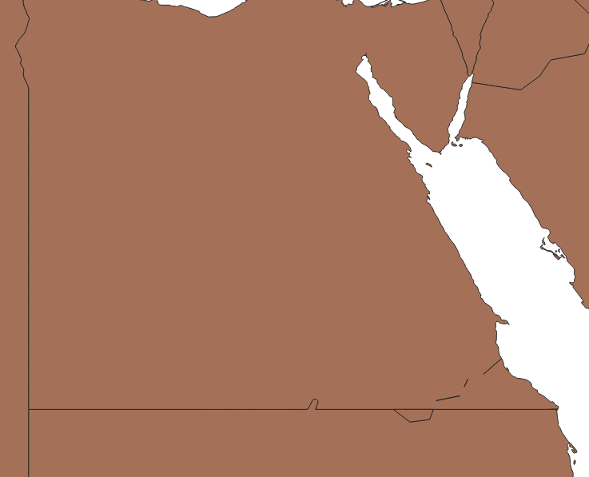

# Correct Natural Earth Shape Files

There are some tiny errors in the data provided by [Natural Earth
Data](https://www.naturalearthdata.com/), which impacted a project I was
working on. I was attempting to import [the
world](https://www.naturalearthdata.com/downloads/10m-cultural-vectors/)
in Elastic, but Elastic has some bug where you can't upload GeoJSON
through the web form, so I had to do it manually, like this:

```bash
$ fields=NAME,ECONOMY,FORMAL_EN,GDP_MD,ISO_A2
$ ogr2ogr -f ElasticSearch  -progress \
    -select $fields \
    -lco NOT_ANALYZED_FIELDS=$fields \
    -lco INDEX_NAME=countries \
    -lco OVERWRITE_INDEX=YES \
    ES:http://localhost:9200 \
    /vsizip/./ne_10m_admin_0_countries.zip/ne_10m_admin_0_countries.shp
```

But ogr2ogr yells at you after processing about 170 countries or so. If
you run the same with the `-skipfailures` option, you'll see every
country gets indexed *except* Egypt! Why?

A look at the json output from ogr2ogr (which I will spare you for the
moment), ultimately lead me to:

```code
"Self-intersection at or near point [35.621087106,23.139292914]"
```

So, I opened it in QGIS and well...



Funny enough the lines in the middle aren't a problem, just this
one point sitting on the border.

Fortunately, QGIS has a Geometry Checker Plugin, but unfortunately, it's
a bit complicated and was a pain to do. If you don't tune it right, you
end up having to sort through lots of "mistakes" which aren't mistakes.

For anyone else who might be down this rabbit hole, Egypt is Object ID
161--I promise that will save you time. Or you could just download my
copy of the file here.

Hoping to use this git repo as part of a bug report, once I read their
process on that.

Included here is an [ESRI shape
file](https://www.loc.gov/preservation/digital/formats/fdd/fdd000280.shtml)
in the `ne_10m_admin_0_countries` directory as well as the same output
in GeoJSON, since I think that format is a bit easier to work with.


## Steps to reproduce the bug

1. Download the original file from Natural Earth

```bash
wget https://www.naturalearthdata.com/http//www.naturalearthdata.com/download/10m/cultural/ne_10m_admin_0_countries.zip
```

2. Try to import the file into Elastic with the series of bash
   commands given earlier. Or alternatively, just:

```bash
$ ogr2ogr -f ElasticSearch  -progress \
    -lco NOT_ANALYZED_FIELDS={ALL} \
    -lco INDEX_NAME=countries \
    -lco OVERWRITE_INDEX=YES \
    ES:http://localhost:9200 \
    /vsizip/./ne_10m_admin_0_countries.zip/ne_10m_admin_0_countries.shp
```

3. Observe you receive a similar error as in `error.json`

As a sanity check, you can re-run the same command without the fancy zip
syntax by manually unzipping:

```bash
$ mkdir -p ne && unzip ne_10m_admin_0_countries.zip -d ne/
$ ogr2ogr -f ElasticSearch  -progress \
    -lco NOT_ANALYZED_FIELDS={ALL} \
    -lco INDEX_NAME=countries \
    -lco OVERWRITE_INDEX=YES \
    ES:http://localhost:9200 \
    ne/ne_10m_admin_0_countries.shp
```

You will get the same error

### Notes

Oddly enough, converting to other formats *will not* yield the same
error. I suspect there is some check that's not done by the GeoJSON
(and maybe other) drivers that the Elastic one does.


``` bash
$ ogr2ogr -progress -f GeoJSON test.geojson /vsizip/./ne_10m_admin_0_countries.zip/ne_10m_admin_0_countries.shp
```

^That runs just fine
